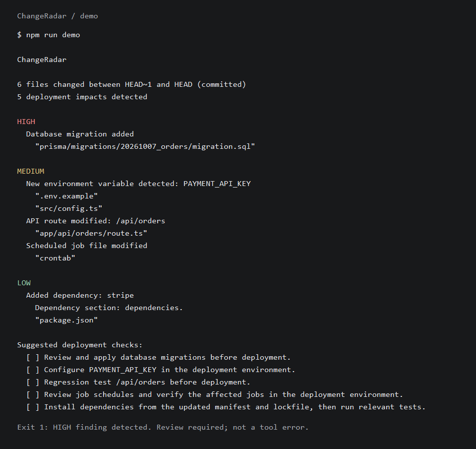

# ChangeRadar

ChangeRadar analyzes Git changes to highlight modifications that may affect deployment: environment variables, database migrations, API routes, dependencies, and scheduled jobs.

Deployments often need steps that a code review can overlook: applying a migration, configuring a new variable, or checking a changed endpoint. ChangeRadar turns those detected changes into a deployment checklist. It reports impacts; it does not decide whether a deployment is safe.



*Preview rendered from the real compiled demo output, not a simulated report.*

## Installation

**Published version: [changeradar@0.1.1](https://www.npmjs.com/package/changeradar), licensed under MIT.** Requires Node.js 22.12 or newer, npm, and Git on your PATH.

### Run With npm

From the Git repository you want to analyze:

```bash
npx changeradar analyze
npx changeradar analyze main...HEAD
```

To select an exact version and save a machine-readable report:

```bash
npx changeradar@0.1.1 analyze main...HEAD --format json > changeradar-report.json
```

For repeated use, an optional global installation exposes the same command:

```bash
npm install --global changeradar@0.1.1
changeradar analyze
```

`npx` can prompt before downloading the package. Analysis exits `1` for HIGH findings and `2` for tool errors, even when invoked through `npx`. References and their history must exist locally. Installation downloads ChangeRadar and its runtime dependencies; it does not install or build the application being analyzed.

Alternatively, download `changeradar-0.1.1.tgz` from the [GitHub release](https://github.com/hannhm1109/ChangeRadar/releases/tag/v0.1.1), verify the checksum in its notes, and use the local-package instructions below.

### Build From Source

```bash
git clone https://github.com/hannhm1109/ChangeRadar.git
cd ChangeRadar
git checkout v0.1.1
npm ci --ignore-scripts
npm run build
npm run demo
```

Build ChangeRadar once, then run its compiled CLI from the Git repository you want to analyze. The working directory selects the repository, not the CLI's location:

```bash
cd /path/to/your-application
node /path/to/ChangeRadar/dist/cli.js analyze
node /path/to/ChangeRadar/dist/cli.js analyze origin/main...HEAD --format json
```

In PowerShell, use a quoted Windows path, for example `node 'C:\tools\ChangeRadar\dist\cli.js' analyze`. No application install/build is required for scanning. References and their history must exist locally.

### Install a Local Package

To produce an installable artifact from the trusted checkout:

```bash
npm pack
```

The `prepack` hook builds the CLI first. The resulting `changeradar-0.1.1.tgz` contains compiled JS/types, the MIT license, documentation, and the runnable demo, not tests, local settings, or development dependencies. Do not skip lifecycle scripts when packing unless you have built and checked the output yourself.

An optional global installation exposes the CLI without a long path:

```bash
npm install --global --ignore-scripts ./changeradar-0.1.1.tgz
cd /path/to/your-application
changeradar analyze
changeradar analyze origin/main...HEAD --format json
```

The artifact contains the build, so installation does not need lifecycle scripts. npm still downloads declared runtime dependencies. On Windows, `changeradar.cmd` can be used when PowerShell blocks npm's `.ps1` shim. Remove a global installation with `npm uninstall --global changeradar`.

## At a Glance

| Detected impact | Severity |
| --- | --- |
| Database migration added, changed, removed, or renamed | HIGH |
| New environment variable reference or example-template key | MEDIUM |
| Next.js API route added, changed, removed, or renamed | MEDIUM |
| Scheduled-job or known deployment/config file changed | MEDIUM |
| Root dependency declaration or lockfile changed | LOW |

Text and JSON share one exit policy: **0** = no HIGH findings, **1** = HIGH findings to review, **2** = tool error. A HIGH finding is not a crashed CLI. [Changelog](CHANGELOG.md) and [release notes](docs/releases/v0.1.1.md) summarize the initial scope.

## Try the Demo

```bash
npm ci --ignore-scripts
npm run build
npm run demo
```

The demo creates a temporary Git repository with two commits, analyzes them with the compiled CLI, and removes only its own temporary directory afterward. It does not change your checkout or Git settings, install sample dependencies, run route handlers, or execute SQL/cron jobs.

The second commit adds a Prisma migration, introduces `PAYMENT_API_KEY` in code and an example template, edits `/api/orders`, adds `stripe`, and changes a cron schedule. Expect **6 changed files and 5 findings**: one HIGH, three MEDIUM, and one LOW. The demo intentionally exits `1` because of the migration.

For a machine-readable demo report, invoke the script directly so npm headers do not enter stdout:

```bash
node scripts/demo.mjs --format json > demo-report.json
```

## Supported Detectors

Environment detection compares variable names in the before-and-after versions of changed JS/TS files and `.env.example` templates. It supports `process.env.NAME`, static `process.env["NAME"]` access, and optional chaining, including JSX/TSX and CommonJS/ES module extensions. One finding per new name lists all matching changed files. Comments, string examples, formatting edits, removed names, value-only template edits, and names moved between changed files do not produce findings.

Only template keys and code references are reported. Actual `.env`, `.env.local`, and other `.env.*` files are excluded from content snapshots and raw patches, except `.env.example`. Source-file symlinks are not followed. No values or raw source are printed.

Both paths of a Git-detected rename involving a private environment file are excluded from raw patches. If such a file is renamed into a supported source, template, or manifest path, content analysis stops with a clear tool error instead of reading the renamed secrets or silently claiming a clean result. Review that rename manually; comparisons after the rename has already been committed can inspect subsequent ordinary changes.

Migration detection reports added, modified, deleted, and renamed files under these root-relative patterns:

- `prisma/migrations/<name>/migration.sql`
- `migrations/` and `database/migrations/`, for `.sql`, `.js`, `.ts`, `.cjs`, `.mjs`, `.cts`, `.mts`, `.py`, `.rb`, and `.php` files

Renames check both paths, so moves into or out of migration directories are reported. Documentation, lock metadata, declaration files, and `.test`/`.spec` files are excluded. Detection is path-based; it does not interpret SQL or execute migrations.

Environment detection compares only changed supported files, not every existing reference in the repository. Dynamic keys, aliases, destructuring, other environment APIs, and lexical shadowing of `process` are not resolved. Unsupported or malformed source syntax produces a tool error rather than an incomplete success report. Nested monorepo migration roots and custom directory configuration are not supported yet.

API-route detection reports additions, edits, deletions, and renames under these root-relative Next.js conventions, also allowing a `src/` prefix:

- App Router: `app/api/**/route.ts` and `route.js`, including `app/api/route.ts`.
- Pages Router: `pages/api/**/*.{js,jsx,ts,tsx}`.

Paths are translated into URL patterns: `app/api/orders/route.ts` and `pages/api/orders/index.ts` both map to `/api/orders`. Dynamic segments such as `[id]`, `[...slug]`, and `[[...slug]]` remain visible as patterns. App Router [route groups](https://nextjs.org/docs/app/api-reference/file-conventions/route-groups) are removed from the URL, including groups before `api`, such as `app/(backend)/api/orders/route.ts`.

Renames include both affected files. A changed URL reports its old and new patterns; a file move that preserves the URL reports a modification. Moves into or out of recognized routing paths report an added or deleted route. Suggested checks identify the affected endpoint and, for removals, its consumers.

The rule is path-based, following the documented [App Router route convention](https://nextjs.org/docs/app/api-reference/file-conventions/route) and [Pages API convention](https://nextjs.org/docs/pages/building-your-application/routing/api-routes). It does not validate handler exports or infer HTTP methods, schemas, or breaking changes. Tests and declarations are excluded conservatively. App Router private folders and advanced parallel/interception layouts are skipped. Route handlers outside `/api`, monorepo app roots, configured page extensions, rewrites, and `basePath` are not resolved.

Dependency detection compares the root `package.json` before and after a change. It reports added, removed, and updated names in `dependencies`, `devDependencies`, `optionalDependencies`, and `peerDependencies`, identifying the affected section. Moving a name between sections reports a removal from one and an addition to the other. Comparison uses declared specifier strings, not installed versions or semantic-version risk. Specifiers and any embedded credentials are not printed.

Formatting, key order, scripts, package version, and other metadata-only edits are ignored. Changed root `package-lock.json`, `pnpm-lock.yaml`, and `yarn.lock` files produce one grouped fallback finding when there are no direct manifest dependency findings. This avoids reporting the same direct update twice while still highlighting lockfile-only resolution changes. Lockfiles are not parsed line by line. A malformed manifest or dependency section produces a tool error. Nested workspace manifests, overrides, bundled dependencies, and other package managers are not analyzed yet. The supported declaration fields follow [npm's package.json documentation](https://docs.npmjs.com/cli/v11/configuring-npm/package-json/).

Cron/config detection uses explicit root-relative paths:

- Scheduled jobs: `crontab`, `crontab.txt`, files named with letters, digits, underscores, or hyphens under `cron.d/`, and `.sh`, `.js`, `.ts`, `.cjs`, `.mjs`, `.cts`, `.mts`, `.py`, `.rb`, or `.php` files under `cron/`.
- Deployment configuration: root [vercel.json](https://vercel.com/docs/project-configuration/vercel-json).
- CI workflows: `.github/workflows/*.yml` and `*.yaml`, following the [GitHub Actions workflow location](https://docs.github.com/en/actions/reference/workflows-and-actions/workflow-syntax).
- Container configuration: root `Dockerfile`, `.dockerignore`, `docker-compose.yml`/`.yaml`, and `compose.yml`/`.yaml`. Dockerfile and Compose variants with `dev`, `development`, `prod`, `production`, `staging`, or `test` suffixes are also supported.

These findings identify additions, edits, deletions, and renames. Moves into or out of recognized paths are reported; moves between categories produce a finding for each affected category. Job tests and declarations are excluded. Configuration contents are not parsed, schedules are not validated, and workflows or containers are not executed. A workflow or Vercel edit is reported as configuration impact, not automatically described as a schedule change. Arbitrary config directories and custom conventions are intentionally excluded.

## Local Development

Requires Node.js 22.12 or newer (an LTS release is recommended), npm, and Git on your PATH.

```bash
npm install
npm run dev
npm run dev -- analyze
npm run dev -- analyze HEAD~1
npm run dev -- analyze main...HEAD
npm run dev -- analyze --help
npm run dev -- --help
npm run dev -- --version
```

To run the compiled CLI:

```bash
npm run build
node dist/cli.js analyze
node dist/cli.js analyze HEAD~1..HEAD
```

## Comparisons

Running `changeradar` without a command is equivalent to `changeradar analyze`. It compares the current working tree against `HEAD`, including net staged and unstaged changes across the entire repository, even when invoked from a subdirectory.

| Input | Before | After | Includes local edits? |
| --- | --- | --- | --- |
| `analyze` | `HEAD` | Working tree | Yes |
| `analyze HEAD~1` | Previous commit | Working tree | Yes |
| `analyze v1.0..HEAD` | Commit at `v1.0` | Commit at `HEAD` | No |
| `analyze main...HEAD` | Common ancestor of `main` and `HEAD` | Commit at `HEAD` | No |

A single reference can be a branch, tag, commit hash, or a revision such as `HEAD~1`. Two-dot compares committed endpoints; three-dot compares the merge base to the right endpoint, following [Git diff semantics](https://git-scm.com/docs/git-diff). Ranges require both endpoints; omitted endpoints and multiple ranges are intentionally unsupported. Comparisons summarize net changes, not every intervening commit.

In working-tree mode, new untracked files are excluded. Run `git add <file>` to include a new file. A repository must have an initial commit. In range mode, files and detector snapshots come entirely from the selected commits, even if local files are modified, deleted, or malformed. Referenced commits must exist locally: fetch missing refs/history in shallow checkouts. Three-dot requires a common ancestor; two-dot can compare unrelated histories.

Working-tree mode rejects unmerged index entries, even if you have edited away conflict markers but have not staged the resolution. Committed ranges remain available during an unresolved local merge because they do not inspect the index or disk contents. Avoid editing files during working-tree analysis; committed comparisons are the reproducible option for CI.

References are verified as commits and pinned to hashes before analysis. Git is invoked without a shell, and untrusted references use [`rev-parse --verify --end-of-options`](https://git-scm.com/docs/git-rev-parse) before they can reach a diff command. Missing references, invalid ranges, and absent common ancestors produce concise errors with exit code `2`, without raw Git output or stack traces.

The report includes changed-file and finding counts, then groups findings by HIGH, MEDIUM, and LOW severity. Each finding lists the relevant files. Suggested checks are deduplicated. Paths are quoted and escaped so tabs and newlines cannot break the report. File contents and raw diffs are not printed.

The report identifies the comparison being analyzed. Severity headings use restrained colors only in interactive terminals. Redirected/piped output is plain text; a non-empty `CI` environment variable, `--no-color`, `NO_COLOR`, `NODE_DISABLE_COLORS`, or `TERM=dumb` also disables colors. Help and version work without Git or a repository.

```text
ChangeRadar

6 files changed against HEAD
5 deployment impacts detected

HIGH
  Database migration added
    "prisma/migrations/20261006_init/migration.sql"

MEDIUM
  New environment variable detected: PAYMENT_API_KEY
    "src/config.ts"
  API route modified: /api/orders
    "app/api/orders/route.ts"
  Scheduled job file modified
    "crontab"

LOW
  Added dependency: stripe
    Dependency section: dependencies.
    "package.json"

Suggested deployment checks:
  [ ] Review and apply database migrations before deployment.
  [ ] Configure PAYMENT_API_KEY in the deployment environment.
  [ ] Regression test /api/orders before deployment.
  [ ] Review job schedules and verify the affected jobs in the deployment environment.
  [ ] Install dependencies from the updated manifest and lockfile, then run relevant tests.
```

## CI Output

Use the compiled CLI directly for machine-readable output. npm's script headers are not part of the JSON format.

```bash
npm ci --ignore-scripts
npm run build
node dist/cli.js analyze origin/main...HEAD --format json > changeradar-report.json
```

`--format text` is the default human-readable report. `--format json` writes exactly one completed JSON document to stdout, with a trailing newline and no terminal colors. Both formats use the same findings and exit-code policy.

The JSON document contains:

- `schemaVersion`: currently `1`; consumers should check this before interpreting the report.
- `comparison`: mode, supplied ref labels, and resolved commit hashes. For three-dot mode, `baseCommit` is the actual merge base. Library contexts without comparison metadata report `null`.
- `summary`: `changedFileCount`, `findingCount`, `bySeverity` counts for HIGH/MEDIUM/LOW, and `exitCode` (`0` or `1`).
- `files`: changed-file statuses and repository-relative paths, including the old path for renames.
- `findings`: detector, severity, title, file paths, and optional description/suggested action.
- `suggestedChecks`: deduplicated deployment checks in report order.

No raw patches, source snapshots, dependency specifiers, secret values, or absolute repository path are serialized. There are no timestamps or progress messages in JSON output. This makes it suitable for saving as a CI artifact or consuming from a script.

A HIGH finding still writes the complete report, then exits `1`. A usage, Git, or detector error exits `2`, leaves stdout empty, and writes a concise diagnostic to stderr. Output-write failures also exit `2`, but a destination may already contain partial bytes; discard that output. An empty or incomplete redirected file after an error is not a clean report. Check the process status before parsing it. Help/version are informational commands, not JSON analysis responses.

## GitHub Actions

[examples/github-actions.yml](examples/github-actions.yml) is a complete pull-request workflow example for this source repository. It is intentionally outside `.github/workflows/`, so adding the example does not enable CI automatically.

The workflow builds ChangeRadar with Node.js 24, checks out the PR head with full history, and compares the event's base/head commit SHAs with three-dot semantics. Full history avoids the default shallow checkout losing a required reference or common ancestor, following the [checkout action documentation](https://github.com/actions/checkout#fetch-all-history-for-all-tags-and-branches).

The analysis step is:

```yaml
- name: Analyze committed PR changes
  id: analyze
  shell: bash
  env:
    BASE_SHA: ${{ github.event.pull_request.base.sha }}
    HEAD_SHA: ${{ github.event.pull_request.head.sha }}
    CI: 'true'
  run: |
    status=0
    node dist/cli.js analyze "$BASE_SHA...$HEAD_SHA" --format json > changeradar-report.json || status=$?
    echo "exit_code=$status" >> "$GITHUB_OUTPUT"
    exit "$status"
```

The full example uploads the report for exits `0` and `1`, including HIGH findings, but does not upload an empty error report. Exiting with the original status still fails the job for HIGH findings or tool errors; there is no `continue-on-error` or unconditional `|| true` hiding failures. If piping through `tee` in another workflow, enable `set -o pipefail` so the pipe does not hide ChangeRadar's status.

Actions are pinned to verified full commit SHAs, credentials are not persisted, and permissions are limited to `contents: read`, following [GitHub's secure-use guidance](https://docs.github.com/en/actions/reference/security/secure-use). The example uses `pull_request`, not a privileged `pull_request_target` workflow, and does not require deployment credentials, secrets, a GitHub App, or PR comments.

For another application repository, provide a trusted built copy of ChangeRadar and invoke its CLI by absolute path while the working directory is the application's Git tree. Do not build the tool from untrusted application PR code or run the application's install/build scripts just to scan its changes. This source-build example is for testing ChangeRadar itself on a disposable hosted runner. If obtaining the tool from npm in CI, pin a reviewed version such as `changeradar@0.1.1` and keep that tool installation separate from the untrusted application checkout.

Missing refs/history or no common ancestor are tool errors, never an assumed clean result. Fetch the required history before analyzing. For a push workflow, use the event's before/after SHAs with two-dot semantics instead; branch-creation events with an all-zero before SHA need an explicit baseline policy.

## Architecture

```text
CLI -> Git adapter -> ChangeContext -> Detectors -> Findings -> Text/JSON reporter
```

- `src/cli.ts` coordinates analysis, writes the completed report, and selects an exit code.
- `src/cli/writeOutput.ts` waits for report writes and handles asynchronous stream failures without ending stdout or exposing stack traces.
- `src/git/gitAdapter.ts` runs Git through Node's `execFile`, passing arguments without a shell. An optional content filter loads before-and-after versions only for selected changed paths; renamed files preserve their original path. Working-tree mode reads disk for the after side; ranges read both sides from commits. The CLI passes `includeDiff: false` because the MVP detectors use metadata and selected snapshots, not raw patches; library callers retain patches by default.
- `src/git/resolveComparison.ts` validates input, resolves commit hashes, and selects the merge base for three-dot comparisons. `ChangeContext.comparison` records the selected mode, labels, and commit endpoints.
- `src/git/parseNameStatus.ts` parses null-delimited file statuses, preserving unusual filenames and rename paths.
- `src/core/types.ts` defines the change context, severity, structured findings, and detector interface.
- `src/core/runDetectors.ts` runs detectors, deduplicates equivalent findings, and orders them by severity.
- `src/core/exitCodes.ts` defines the analysis policy once, shared by the CLI and JSON summary.
- `src/detectors/migrationDetector.ts` recognizes migration paths and change statuses.
- `src/detectors/environmentDetector.ts` compares environment names using [Babel's JS/TS parser](https://babeljs.io/docs/babel-parser) for code and Node's built-in [parseEnv](https://nodejs.org/api/util.html#utilparseenvcontent) for example templates. Parsing syntax avoids treating comments and strings as executable references; no type checking or code execution is performed.
- `src/detectors/apiRouteDetector.ts` maps supported Next.js file paths to API URL patterns and checks both sides of renames.
- `src/detectors/dependencyDetector.ts` compares dependency maps with JSON parsing and summarizes unexplained lockfile changes.
- `src/detectors/cronConfigDetector.ts` flags known job and configuration paths without reading their contents.
- `src/reporters/terminalReporter.ts` formats findings without running Git or printing directly.
- `src/reporters/jsonReporter.ts` creates versioned machine-readable reports from metadata and findings, not raw context contents.
- `src/errors/ChangeRadarError.ts` provides typed errors with user-facing messages.

Each detector implements `name` and `detect(context): Finding[]`. To add a detector, implement that interface and register it in the CLI's detector list. Detection stays independent of formatting, so text and JSON reports reuse exactly the same findings.

When using the library directly, load source and manifest contents before running their detectors:

```ts
import {
  getChanges, runDetectors, isEnvironmentSource, isDependencyManifest,
  environmentDetector, migrationDetector, apiRouteDetector, dependencyDetector, cronConfigDetector,
} from "changeradar";

const context = await getChanges(process.cwd(), {
  comparison: "main...HEAD", // Omit to analyze local changes against HEAD.
  includeContent: (path) => isEnvironmentSource(path) || isDependencyManifest(path),
});
const findings = runDetectors(context, [
  migrationDetector, environmentDetector, apiRouteDetector, dependencyDetector, cronConfigDetector,
]);
```

The environment detector requires content snapshots; the dependency detector requires a snapshot for each changed root manifest. Both fail clearly if required contents were not loaded. The CLI loads them automatically.

Duplicate findings have the same detector, severity, title, description, file set, and suggested action. Different files or advice remain separate findings. A detector failure stops analysis with a tool error instead of producing an incomplete success report.

## Checks

```bash
npm run typecheck
npm test
npm run build
node --check scripts/demo.mjs
node --check scripts/check-package.mjs
npm run check:package
git diff --check
```

Tests cover Git parsing, real temporary Git repositories and divergent histories, all five detector categories, duplicate handling, report formatting/colors, and complete CLI analysis with exit codes. Comparison tests include dirty working trees, historical tags, missing refs, unrelated histories, renames, and secret exclusions.

CI tests cover JSON/text exit-code parity, complete reports on HIGH findings, empty stdout on analysis errors, automatic color suppression, and shallow clones before and after fetching missing history.

`check:package` builds and packs the project, checks the shipped file allowlist, installs it in a temporary directory with only runtime dependencies and lifecycle scripts disabled, then tests CLI help/version, npm's installed command shim, library exports, all five demo categories, and exit/error behavior. It requires registry access for dependency installation and cleans up only its own temporary directory.

The README preview can be regenerated on Windows after building with `powershell -NoProfile -File scripts/capture-demo.ps1`. It renders the demo's actual captured output into a PNG; it does not require a terminal recording service.

Strict TypeScript checks also reject unused locals/parameters and accidental switch fallthrough. No separate lint dependency is required for these checks. Regression tests cover secret renames, unresolved index entries, unusual migration filenames, asynchronous write failures, and skipping large unrelated patches. Git command output and selected contents are bounded to 20 MiB; individual Git commands time out after 30 seconds. The CLI avoids generating raw patches, but large selected source/manifests still produce a tool error rather than an incomplete report.

The full suite and compiled demo have been verified on Windows with Node.js 22.12.0 and 24.13.1. The Actions YAML is validated locally; it remains a usage example, not an automatically enabled hosted workflow.

## Troubleshooting

| Symptom | Check |
| --- | --- |
| A new file is missing from local analysis | Stage it with `git add`; untracked files are excluded. |
| Cannot resolve a reference / no common ancestor | Fetch the required refs and history, especially in a shallow checkout. |
| Unresolved merge conflicts | Resolve and stage all conflicted files, or analyze committed endpoints. |
| A private environment file was renamed into source | Review the rename manually; ChangeRadar deliberately refuses to load those contents. |
| Source or manifest parsing fails | Fix malformed syntax/JSON or review unsupported syntax; analysis is not treated as successful. |
| A selected file or Git result exceeds the content limit | Narrow the committed comparison or reduce the selected file size; omitted analysis is not reported as clean. |
| Unable to write the report | Check the consuming pipe, destination permissions, and disk space; discard any partial report. |

## Exit Codes

- `0`: analysis completed with no HIGH findings (MEDIUM/LOW findings are non-blocking), or help/version displayed.
- `1`: analysis completed with at least one HIGH finding; the full report is still available.
- `2`: CLI usage or tool execution error; no completed analysis report is produced, even if an earlier detector found HIGH impacts. Output-write failures may leave partial bytes, which must be discarded.

This policy is identical in text and JSON modes, locally and in CI. Exit `0` does not guarantee a safe deployment; it only means no HIGH impacts were detected by the enabled rules. For a non-blocking review workflow, handle exit `1` explicitly while continuing to fail on exit `2`; do not swallow every non-zero result.

ChangeRadar highlights detected impacts; humans still decide whether and how to deploy.

## Roadmap

Possible next steps, intentionally not included in v0.1.1:

- Small explicit configuration for custom paths and severity rules.
- Explicit workspace roots for monorepos.
- Additional framework route conventions with focused tests.
- Broader platform verification and real-world feedback before expanding detection rules.

## Release Preparation

[docs/releases/v0.1.1.md](docs/releases/v0.1.1.md) contains the licensed release notes. The tag and package version are `v0.1.1` and `0.1.1`. The existing `v0.1.0` tag is retained as the original unlicensed candidate; it is not rewritten. No npm publish automation or privileged release workflow is enabled.

Before tagging a future release, run the checks above, inspect `npm pack --dry-run --ignore-scripts --json` after building, and verify the changelog/version. Create a tag at the verified commit rather than tagging an unreviewed checkout. Publication remains a separate deliberate action.

## License

MIT. See [LICENSE](LICENSE). Runtime dependencies retain their own licenses.
